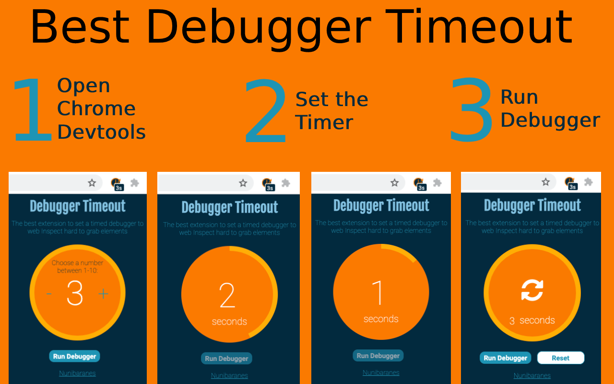

## Debugger Timeout

Capturing elements that are influenced by DOM events can be frustrating. **Debugger Timeout** is the ultimate Chrome extension that allows you to set a timed debugger, enabling you to inspect hard-to-grab elements on the web with ease.

### Features
- **Timed Debugger:** Set a countdown timer to pause your application, giving you a chance to inspect elements in their relevant states, such as dragging, hovering, or focused.
- **User-Friendly Interface:** Simple controls to set your desired countdown and activate the debugger.
- **Compatibility:** Works seamlessly with Chrome DevTools for a streamlined debugging experience.
  
### How to Use

1. **Open Chrome DevTools:**
   - Make sure Chrome DevTools is open for the extension to function properly.
   - Right-click on any element on the webpage you want to inspect and select “Inspect” (or “Inspect Element” depending on your version).
   - Shortcuts: 
     - **Windows/Linux:** `Ctrl` + `Shift` + `I` or `F12`
     - **Mac:** `Cmd` + `Option` + `I` or `F12`
   
2. **Open Debugger Timeout Extension:**
   - Click on the Debugger Timeout icon in the Chrome toolbar to open the extension.

3. **Set Countdown Timer:**
   - Use the “+” and “-” buttons to adjust the countdown duration. This setting determines how long the countdown will run before the application freezes, allowing you to inspect the elements in their current state.

4. **Run the Debugger:**
   - Click the “Run Debugger” button to start the timer. Once activated, your application will freeze for the specified duration, enabling you to inspect the desired elements in their current state.

 

### Use Cases
- **Drag-and-Drop Components:** Easily inspect elements during drag-and-drop actions.
- **Dynamic UI Elements:** Capture elements that change states quickly due to user interactions.
- **Testing and Development:** Streamline your testing process by providing clear visibility into the UI during debugging.
  
## In progress

- Setting page
- Context menu options
- Milliseconds / Seconds Toggle
- Keyboard shortcut - settings
- Open devtools programmatically

### Support
If you encounter any issues or have questions about the Debugger Timeout extension, please open an issue on the [GitHub repository](https://github.com/nunibaranes/debugger-timeout-chrome-extension/issues).

### Installation
You can download and install the Debugger Timeout extension from the [Chrome Web Store](https://chromewebstore.google.com/detail/debugger-timeout/elmehliiloojeenadcoppopohddbjgfk).

## License
This project is licensed under the MIT License - see the [LICENSE](./LICENSE.txt) file for details.

## Authors

- **Nofar Baranes** - [nunibaranes](https://github.com/nunibaranes)
